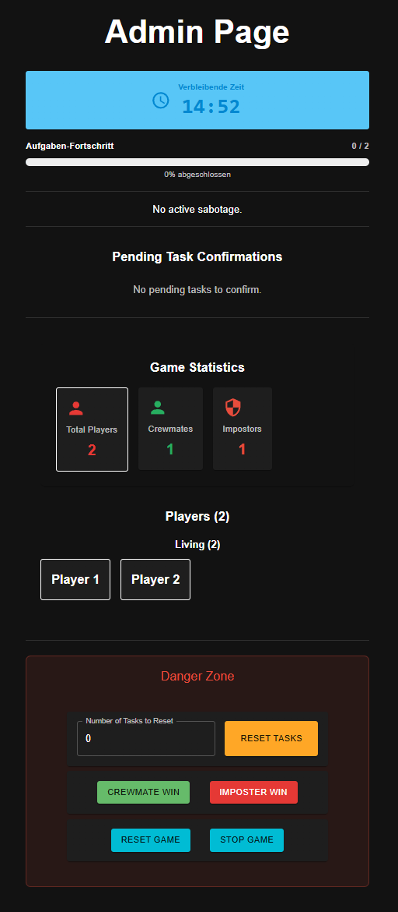
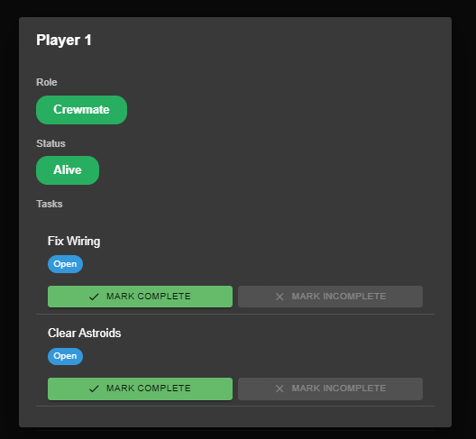

# Among Us - Real Life Edition

A full-stack web application for playing Among Us in real life with Socket.IO-based real-time updates, configurable game settings, and a complete admin dashboard.

## Demo

[Watch Demo Video](demo/amongus_demo.mp4)


## Features

### Admin Dashboard
- **Game Configuration** - Customize tasks, sabotages, impostor count, kill cooldowns
- **Player Management** - Monitor all players, view roles, track task progress, manage player status
- **Task Control** - Approve/reject task confirmations, view pending and completed tasks
- **Sabotage System** - Configure sabotage types with cooldowns and manage active sabotages
- **Meeting Control** - Start meetings, view votes, end voting sessions

### Player Experience
- **Role Assignment** - Random impostor/crewmate assignment with role reveal
- **Task Management** - View assigned tasks, request confirmation from admin, and track progress
- **Emergency Meetings** - Report dead bodies and participate in voting
- **Sabotage Events** - Configurable sabotages (optionally with countdowns)
- **Game Control** - Decide winning team manually
- **Live Updates** - Real-time game state synchronization via Socket.IO





## Tech Stack

- **Frontend**: React + Vite + Material-UI
- **Backend**: Python + FastAPI + Socket.IO
- **Deployment**: Docker + Docker Compose + GitHub Actions

## Quick Start

### Using Docker (Recommended)

```bash
cd docker
docker compose up -d
```

Access the app at:
- **Players**: http://localhost
- **Admin**: http://localhost/admin

Default credentials (change in `.env` or docker-compose.yml):
- Admin password: `adminpass`
- Player password: `playerpass`

### Local Development

**Backend:**
```bash
cd server
python -m venv .venv
source .venv/bin/activate 
pip install -e .
python main.py
```

**Frontend:**
```bash
cd web
npm install
npm run dev
```

Create `web/.env`:
```
VITE_SOCKET_URL=http://localhost:5000
VITE_SOCKET_PATH=/socket.io
VITE_ADMIN_PASSWORD=adminpass
VITE_PLAYER_PASSWORD=playerpass
```

Sync the passwords with `server/.env`
```
ADMIN_PASSWORD=adminpass
PLAYER_PASSWORD=playerpass
```

## Configuration

Game settings are configurable via the admin dashboard:
- **Game Config**: Task requirements, impostor count, kill cooldown, max players per task
- **Tasks**: Add/edit/remove available tasks with images and names
- **Sabotages**: Configure sabotage types with durations and charges

Configuration is persisted in `server/config/` JSON files.

## Warning

This project is not optimized for performance, maintainability or security! Use at your own risk
